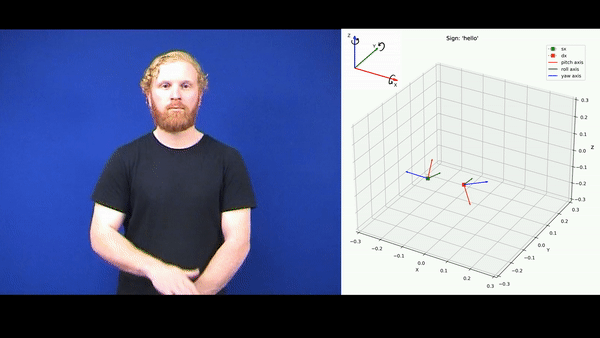

# auslan-classification
Project concerning classification of AUSLAN signs.  Done for the Mathematics in Machine Learning course @ Politecnico di Torino

  

Roadmap:
- [X] implementare gli algoritmi
- [ ] entro venerdì 16 settembre aver terminato tutto il codice (a meno di visualizzazioni) + aver lanciato tot esperimenti.
    - [X] aver modificato utils, dividendolo in diversi file python
    - [ ] pulizia codice, mantenendo solo i files finali come finals e quelli di visualizzazione + utils e funzioni varie 
- [ ] tesina entro il 23 settembre averla completata + svolgere la presentazione se possibile. Altrimenti ricade nella settimana dal 24 al 30
- [ ] inviare il tutto il 30 settembre / lunedì successivo
- [ ] ripulire la repo e scrivere il readme

