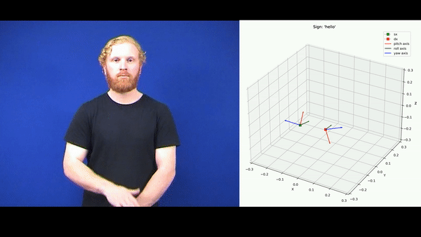

# auslan-classification
Project concerning classification of AUSLAN signs.  Created for the Mathematics in Machine Learning course @ Politecnico di Torino

## AUSLAN Dataset
The dataset [[1]](#1) is available at the [UCI Machine Learning repository](https://archive.ics.uci.edu/ml/datasets/Australian+Sign+Language+signs+(High+Quality)).
It contains 27 examples for each of the 95 classes of signs. All the examples are Multivariate Time Series (MTS) characterised by 22 predictors, 11 for each hand. 
Each example describes an action the signer does to represent a certain sign. A visualisation is reported in the following gif: 

  

For the following analysis, the dataset was split into training (77.77%) and test (22.22%) set.

## Approaches
Two different approaches were followed:
- "PCA based" approach. This approach aims to transform MTS data into feature vectors that can be used with plain SVM and Random Forests algorithms. Both linear PCA and kernel PCA was explored. In particular, the latter was based on the _KEros_ kernel [[2]](#2), whose code we implemented from scratch. 
- "Raw MTS" approach. This one leverages on the extension of classical Machine Learning to deal with MTS data. We used K-NN with _Dynamic Time Warping_ as the distance metric, SVM with _Global Alignment Kernel_, and _Time Series Forest_

## Results
For each algorithm, the hyperparameter search was performed with a 5-fold cross-validation on the training set using the accuracy metric. Once the best combination is found, the corresponding algorithm is trained on the whole training set. The following hyperparameters and results was found:

|**Algorithm**|**Hyperparameters best combination**|**Accuracy**|
|-------------|------------------------------------|------------|
|Linear PCA: SVM|Linear kernel, C = 1|0.935|
|Linear PCA: RF|Gini index, max. depth = 30, min. samples per leaf = 1, min. samples per split = 2, 200 estimators|0.889|
|K-PCA: KEros SVM|Polynomial kernel, C = 0.005, $\beta$ = 5,degree = 30, r = 1|0.958|
|K-PCA: KEros RF|Entropy, max. depth = 30, min. samples per leaf = 1, min. samples per split = 10, 200 estimators|0.491|
|KNN with DTW|Number of neighbours = 1, uniform weighting scheme|0.781|
|Time Series Forest|200 estimators, min. interval length = 4|0.932|
|SVM with GAK|C = 0.0001, $\beta$ = 1|0.849|

In the linear case, 54 principal components explain 95% of the variance of the original data. Thus, 54 principal components were taken into account for both linear and kernel PCA.

For more details on the dataset and the whole work, we suggest you to __read our report__ and __visit__ the [UCI Machine Learning repository](https://archive.ics.uci.edu/ml/datasets/Australian+Sign+Language+signs+(High+Quality)).

## References
<a id="1">[1]</a>
Kadous, M. W., "Temporal Classification: Extending the Classification Paradigm to Multivariate Time Series", PhD Thesis (draft), School of Computer Science and Engineering, University of New South Wales, 2002. 

<a id="2">[2]</a> 
Yang, K. and Shahabi, C., 2005, November. A pca-based kernel for kernel pca on multivariate time series. In IEEE Intern. Conf. on Data Mining.

## Authors
You can reach us at our contacts:
- Lorenzo Scarciglia (Polytechnic of Turin) https://github.com/notlosca, lorenzo.scarciglia@studenti.polito.it
- Andrea Silvi (Polytechnic of Turin) https://github.com/andrea-silvi, andrea.silvi@studenti.polito.it
